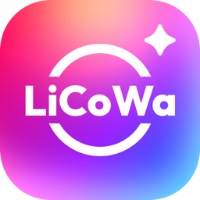
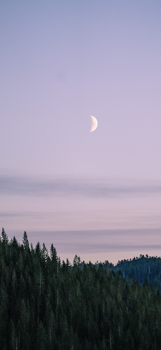
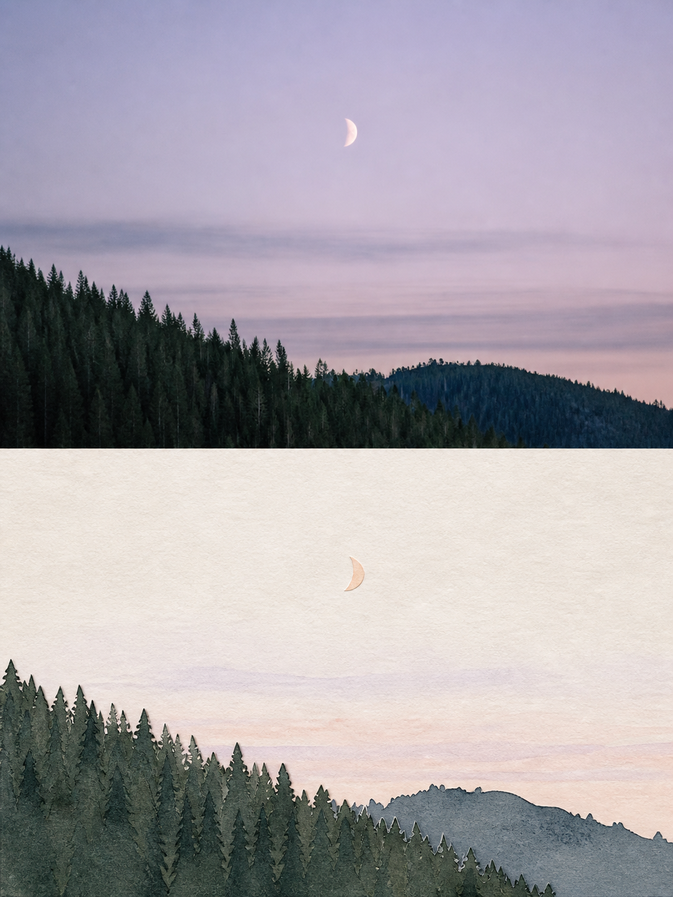
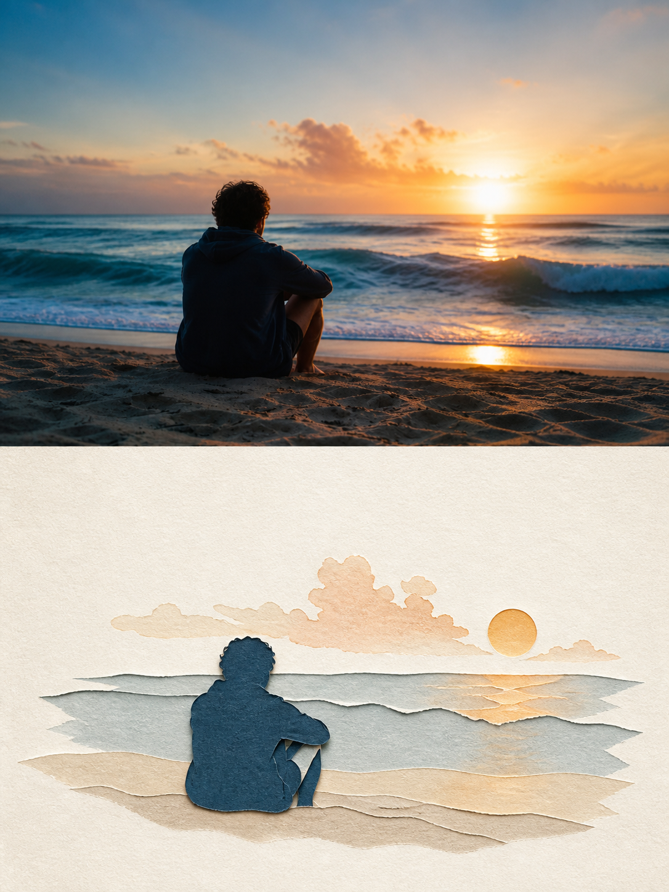
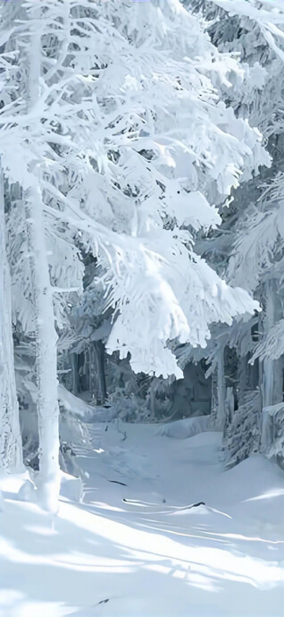
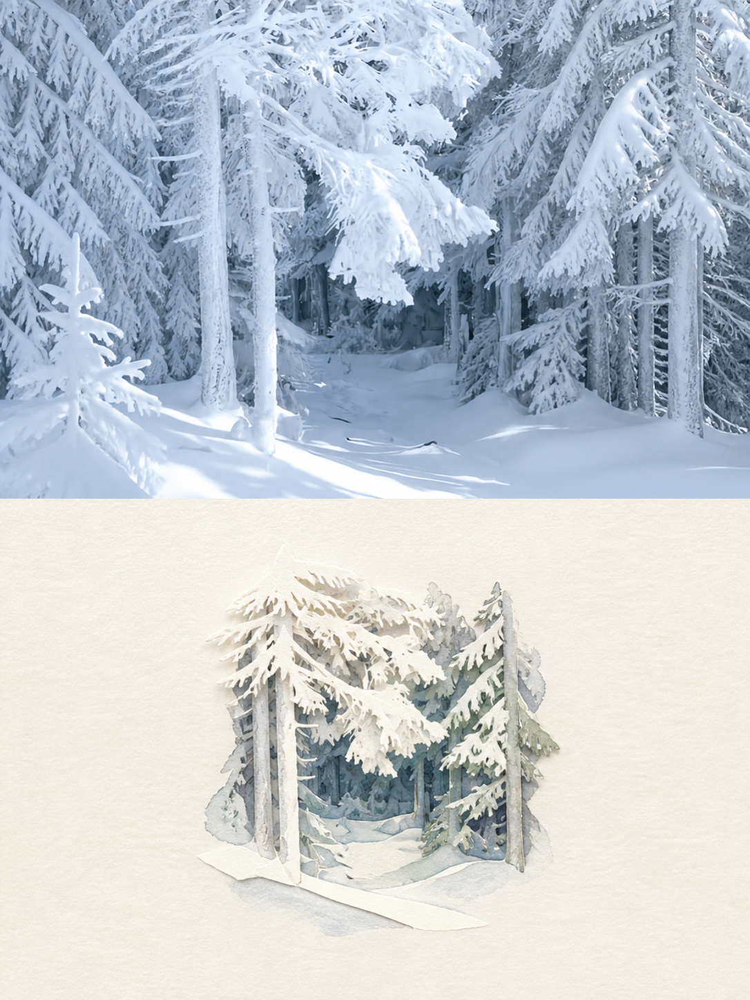
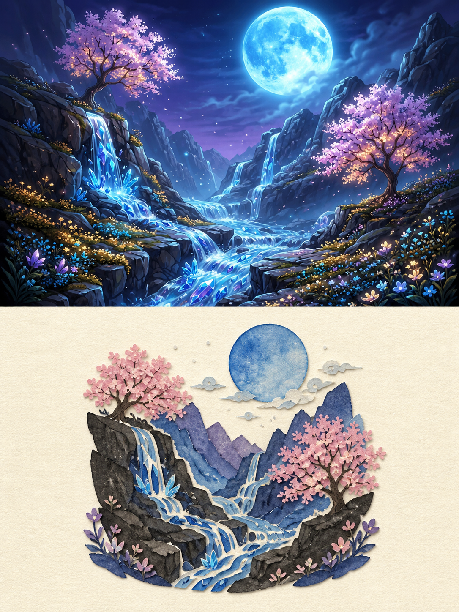

# Light Paper Realm

> [中文](README.md) ｜ [English](README.en.md)

[](LICENSE)


[Licowa](#recommended-wallpaper-source-licowa) · [Examples](#example-gallery) · [Usage](#use-in-codex) · [Parameters](#adjustable-parameters) · [FAQ](#faq-and-limits) · [Contributing](#contributing) · [Sources](#licowa-sources-and-usage-notes)

## Recommended wallpaper source: Licowa

[ **LiCoWa**](https://licowa.com/)

Looking for a suitable wallpaper to transform? Browse [Licowa Trending Wallpapers](https://licowa.com/wallpaper/trending) for inspiration or source wallpapers, then use this project to create a paper editorial poster. Licowa provides wallpaper browsing and download entry points, as well as DIY wallpaper, photo booth, photo collage, and AI image-editing tools.

The repository's eight examples are selected from Licowa's wallpaper service solely to demonstrate this workflow. The wallpapers themselves are not covered by this repository's MIT License; see [Licowa sources and usage notes](#licowa-sources-and-usage-notes) below for provenance and reuse guidance.

## What is Light Paper Realm?

**Light Paper Realm** turns one photograph into a text-free 3:4 editorial cover: faithful photography above, and a small handmade paper visual poem below.


## Example gallery

All eight Licowa wallpaper examples are collected here. Each row pairs the original wallpaper with its generated Light Paper Realm result.

| Source wallpaper | Paper editorial poster |
| --- | --- |
|  |  |
|  |  |
|  |  |
|  |  |
|  |  |
|  |  |
|  |  |
|  |  |

## What it creates

- A precise 3:4 portrait poster with a crisp 50:50 horizontal split.
- A faithful, photographic upper half—source composition, subject, lighting, and atmosphere stay intact.
- A minimal lower-half illustration on warm paper with generous negative space and a palette sampled from the photograph.
- No newly generated text, including Chinese characters, Latin letters, numbers, logos, captions, or pseudo-typography.

### Core prompt preview

The complete prompt is public: native-editor, cross-platform positive/negative, and one-shot text-removal variants are all included. Its essential system is simple: **strict 3:4; an exact 50:50 split; the lower half reduces the same scene into a restrained paper image.**

> `Create exactly one 3:4 portrait editorial poster. Divide the canvas into two equal 50% sections: faithful photography above; a small handmade paper illustration of the same scene below. No visible text in any language.`

View or copy the [full prompt recipes](light-paper-realm/references/prompt-recipes.md). The original source prompt is preserved separately in [original-prompt.md](docs/original-prompt.md).

### Adjustable parameters

| Parameter | Recommended start | Effect of adjustment |
| --- | --- | --- |
| Canvas ratio | 3:4 portrait | Other ratios work when the two regions remain equal. |
| Panel split | 50:50 | You can explore alternatives, but all standard examples use 50:50. |
| Paper motif size | 10–20% of the lower panel | Smaller is quieter; larger is more narrative. |
| Negative space | Keep most of the lower panel open | Less space reads as illustration; more feels like an editorial art book. |
| Palette | 3–4 colors sampled from the photo | Fewer colors improve paper character and visual continuity. |
| Reference strength | High | Better preserves the upper image; low strength may reimagine the scene. |

## Use in Codex

1. Copy the `light-paper-realm` directory into your Codex skills directory (usually `~/.codex/skills/`).
2. Start a new task, upload a photo, and write:

   ```text
   Use $light-paper-realm to generate.
   ```

The skill chooses the built-in image editor when available. It inspects the result and performs one focused correction pass if newly generated text appears.

## Use on another image platform

Open [the cross-platform prompt recipe](light-paper-realm/references/prompt-recipes.md#b-cross-platform-recipe). Put the **Positive prompt** and **Negative prompt** into their matching fields, replace `<SCENE>` with a short factual description of your image, and attach the original photo as the reference image.

If the platform has an image/reference strength control, use a strong setting: the subject and composition should be preserved rather than reimagined. If a result still invents writing, use the one-time [text-removal correction prompt](light-paper-realm/references/prompt-recipes.md#c-text-removal-correction-prompt).

### FAQ and limits

<details>
<summary><strong>Why can generated text still appear?</strong></summary>

Image models can hallucinate typography. Use the supplied negative prompt, then perform the single targeted text-removal correction. Text already embedded in the source is not guaranteed to be removed without altering the source.
</details>

<details>
<summary><strong>How can I improve upper-panel fidelity?</strong></summary>

Use a high reference-strength setting and request only peripheral background extension. Avoid adding new subjects or style directions. Faces, tiny signage, and dense architecture remain model-dependent.
</details>

<details>
<summary><strong>What is this workflow not for?</strong></summary>

It is not intended for precise text layout, brand-logo work, editable vector art, or pixel-perfect reconstruction. Its purpose is a visual echo between faithful photography and a paper-art interpretation.
</details>

## Contributing

Contributions of Licowa examples, cross-platform comparisons, prompt improvements, and translations are welcome. Read [CONTRIBUTING.md](CONTRIBUTING.md) first. Third-party wallpapers must have clear provenance, be suitable for public display, and contain no identifiable private information.

## Project layout

```text
light-paper-realm/      # Installable Codex Skill
docs/original-prompt.md # Original prompt preserved from the source X thread
examples/source/        # Attributed reference photos
examples/output/        # Generated examples
docs/THIRD_PARTY_NOTICES.md
```

## Text-free behavior

Image models can still hallucinate writing. This project mitigates that with three layers:

1. English-only positive instructions that explicitly ban visible writing in every language.
2. A dedicated negative prompt for platforms that support it.
3. One targeted repair prompt that replaces only invented text with blank paper, clean negative space, or naturally non-legible detail.

This cannot remove readable text that is already embedded in a source photo without altering the source. The skill therefore avoids enlarging, recreating, or sharpening source signage by default.

## Licowa sources and usage notes

The eight examples in this repository pair Licowa wallpapers with generated workflow demonstrations. Their source pages, file mapping, and reuse notes are listed in [THIRD_PARTY_NOTICES.md](docs/THIRD_PARTY_NOTICES.md). The code and prompt workflow are released under the [MIT License](LICENSE); the included wallpaper references remain subject to Licowa's applicable terms.

## Source prompt

The original prompt came from [this X post](https://x.com/king1818888/status/2094566588087509050) and its [companion restriction post](https://x.com/king1818888/status/2094566592709636528). It is preserved in [docs/original-prompt.md](docs/original-prompt.md), with the reusable implementation refined in `light-paper-realm/`.
