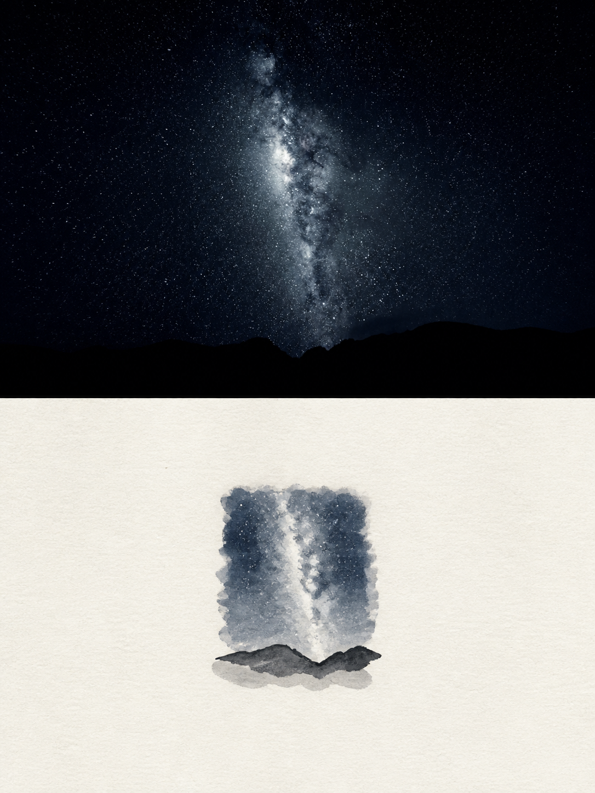
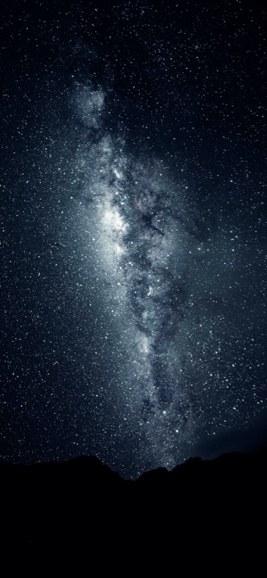
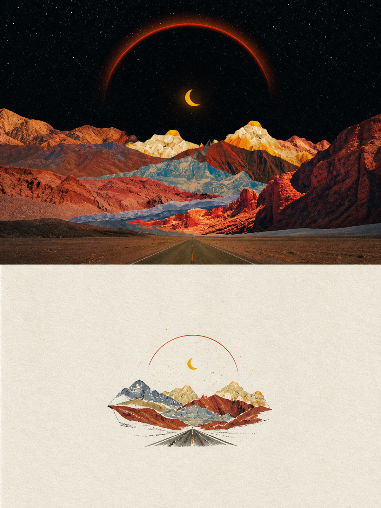
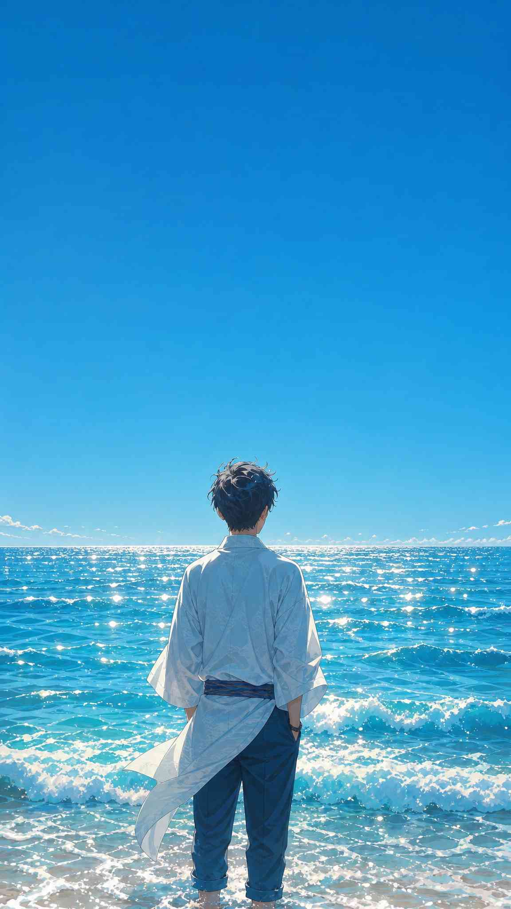
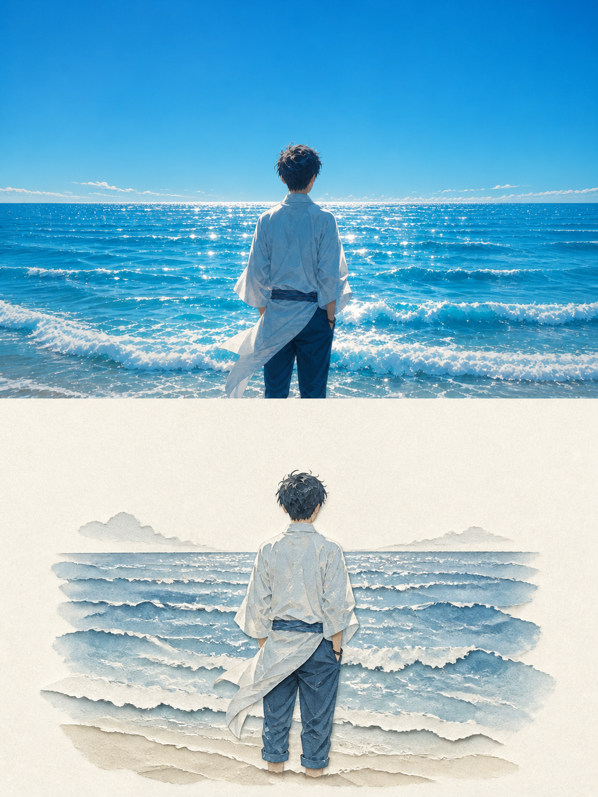
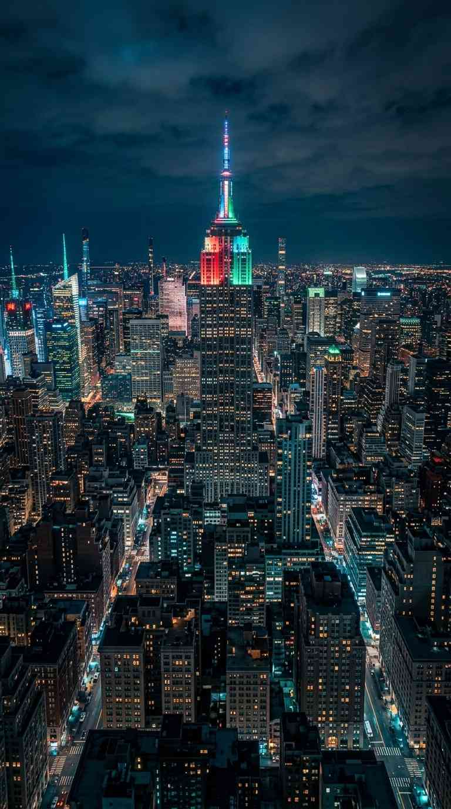
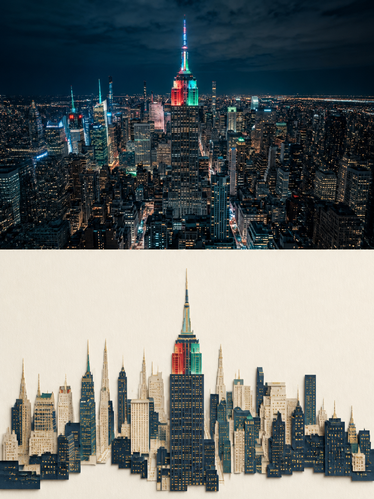

# Photo Paper Poem

> [中文](README.md) ｜ [English](README.en.md)

## 中文说明

**Photo Paper Poem（照片纸艺诗）** 是一套把单张照片转成“编辑艺术出版物封面”的提示词与 Codex Skill：上半部分保留原照片的真实感，下半部分将同一画面提炼成留白充足的手工纸艺小插画。



### 它能做什么

- 生成严格 **3:4 竖版、上下各占 50%** 的分屏视觉。
- 上半保持原图主体、构图、光线和氛围，避免把照片重绘成陌生场景。
- 下半采用暖白纸张、手绘线条、克制色块与大量留白，形成同一叙事下的“视觉小诗”。
- 默认**不生成文字**：禁止中文、英文、数字、Logo、水印、标题和伪文字；对于原图招牌，默认避免放大、锐化或重新生成。

### 在 Codex 中使用

1. 将 `skill/photo-paper-poem` 复制到 Codex 的技能目录（通常为 `~/.codex/skills/`）。
2. 上传图片后输入：

   ```text
   使用 $photo-paper-poem 生成
   ```

Skill 会优先保真地处理源图；若结果出现模型新生成的文字，会执行一次只去除文字的定向修正。

### 在其他出图平台使用

打开 [跨平台提示词](skill/references/prompt-recipes.md#b-cross-platform-recipe)，将 **Positive prompt** 和 **Negative prompt** 分别粘贴到平台对应字段，将 `<SCENE>` 换成图片的客观描述，再上传原图作为参考图。

如平台提供参考图强度/相似度，优先选择较高档位。生成时仍出现文字，可使用仓库内的 [一次性去字修正提示词](skill/references/prompt-recipes.md#c-text-removal-correction-prompt)。

## 案例预览

四组 Licowa 壁纸案例集中展示如下：左侧为原壁纸，右侧为 Photo Paper Poem 生成结果。

| 原壁纸 | 纸艺编辑海报 |
| --- | --- |
|  |  |
|  |  |
|  |  |
|  |  |

### 壁纸灵感与获取

需要壁纸作为灵感或原始图片时，推荐浏览 [Licowa 热门壁纸](https://licowa.com/wallpaper/trending)。该网站/产品提供壁纸浏览与下载入口，同时围绕拍贴、DIY 壁纸、照片拼贴和 AI 图片编辑提供创作功能。你可以从该页面获取喜欢的壁纸，再使用本项目转成纸艺编辑海报；下载与二次使用请遵循 Licowa 页面展示的许可与使用条款。

### 案例与素材说明

本仓库包含 Licowa 的四组“原图 → 生成结果”案例：星空山脊、红色山谷公路、盛夏海面与霓虹城市夜景。案例来源页面、素材文件和使用提示见 [第三方素材说明](docs/THIRD_PARTY_NOTICES.md)。项目代码与提示词以 MIT 协议发布；案例壁纸的使用仍应遵循 Licowa 的适用条款。
